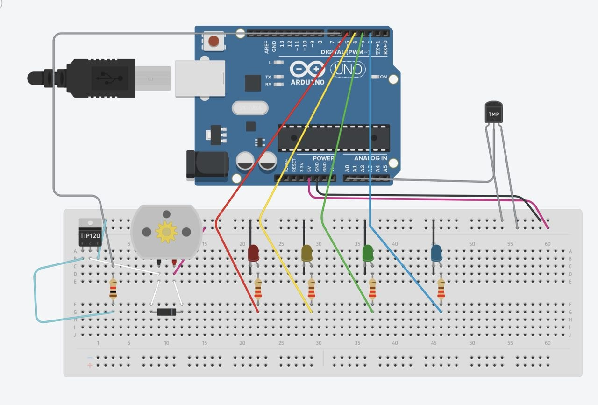
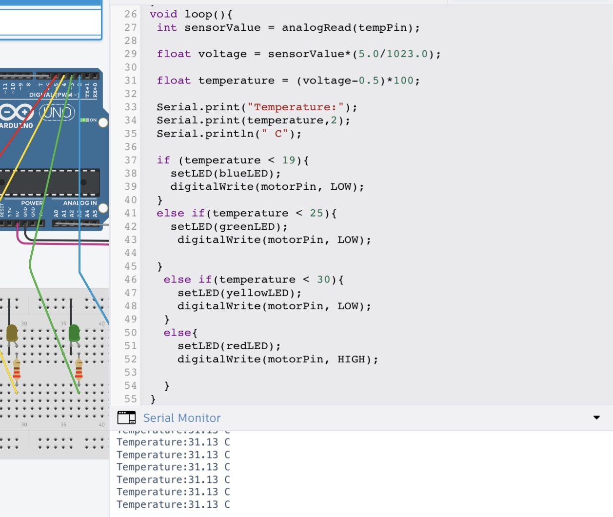
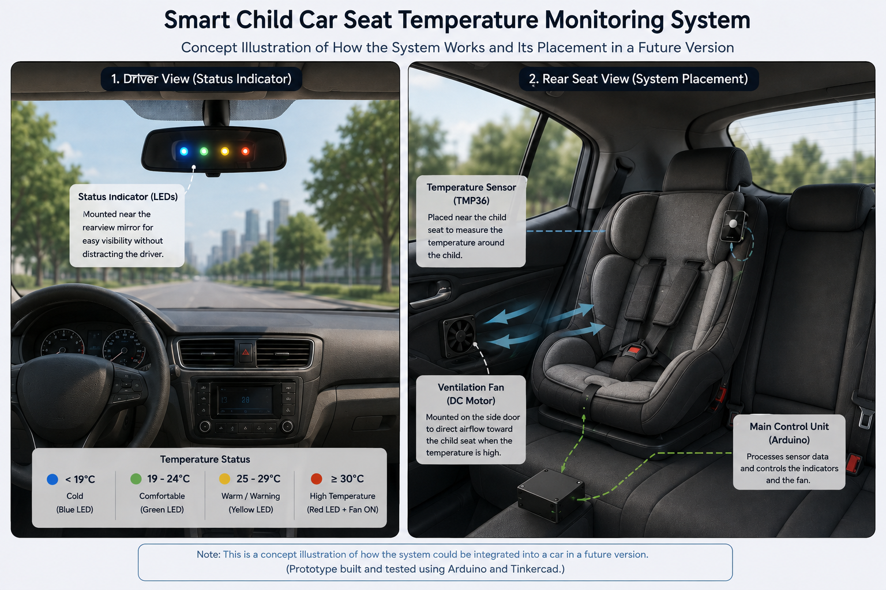

# Smart Child Car Seat Temperature Monitoring System

## Project Idea

The idea for this project came while looking for a real-world problem that could be addressed using IoT technologies.

I was reminded of a concern raised by a family member about temperature around child seats in cars, particularly in rear seats where airflow may not reach the child as effectively as it does the front seats.

This led to the idea of developing a prototype that monitors the temperature around a child car seat and provides a clear visual indication when the temperature changes.

The system also includes a DC motor to simulate a ventilation fan. The idea is that increased airflow around the child seat could help reduce heat buildup in the area when the temperature becomes high.

The project is not intended to replace a vehicle's air-conditioning system or provide complete cooling. Instead, it explores how a simple IoT system could monitor temperature, provide an easy-to-understand warning, and trigger a ventilation mechanism when the temperature reaches a high range.

## Temperature Research

Before defining the temperature ranges used in the system, I looked into general temperature recommendations and the effects of cold and heat on children.

Based on this research, the project uses four simplified temperature ranges to represent different conditions:

## Temperature Ranges

- Below 19°C — Cold: Blue LED
- 19–24°C — Comfortable: Green LED
- 25–29°C — Warm / Warning: Yellow LED
- 30°C and above — High Temperature: Red LED + Fan

These ranges are used as a practical reference for the prototype and are not intended to represent a medical or safety standard.

## Why LEDs Instead of a Display?

Colored LEDs were chosen instead of a digital display as a deliberate design choice.

The goal was to make the temperature status easy to understand at a glance, without requiring the driver to read a numerical value or focus on a screen while driving.

Each color represents a different temperature condition, making the system simple and quick to interpret.

When the temperature reaches the highest range, the red LED is activated and the DC motor is used to simulate a ventilation fan, representing increased airflow around the child seat.

## How It Works

1. The TMP36 temperature sensor measures the temperature around the child seat.
2. Arduino reads the sensor's analog voltage.
3. The voltage is converted into a temperature value in Celsius.
4. The system determines the corresponding temperature range.
5. The appropriate LED is activated to indicate the current temperature condition.
6. When the temperature reaches 30°C or higher, the red LED is activated.
7. At the same time, the DC motor is activated to simulate a ventilation fan, representing increased airflow around the child seat.

## Components

- Arduino Uno
- TMP36 Temperature Sensor
- Blue LED
- Green LED
- Yellow LED
- Red LED
- Resistors
- DC Motor (used to simulate a ventilation fan)
- TIP120 Transistor
- Diode
- Breadboard

## Technologies

- C++
- Arduino Uno
- TMP36
- Tinkercad Circuits
- Basic Electronics

## Future Improvements

Possible improvements for a future version include:

- Replacing the simulated DC motor with a practical ventilation fan designed for the intended environment.
- Using wireless communication to reduce the number of wires around the child seat.
- Placing the temperature sensor near the child seat while keeping the main controller in a safer and more accessible location.
- Adding wireless notifications for the driver.
- Testing the system using real-world temperature measurements under different vehicle conditions.

## Project Status

Completed prototype.

## Project Images

### Prototype

### Temperature Monitoring Output

### Concept Illustration

